# Python 기초 퀴즈 게임

Python 기초 문제를 풀고, 사용자가 직접 퀴즈를 관리하며, 최고 점수와 게임 기록을 JSON 파일에 저장할 수 있는 콘솔 프로그램입니다.

## 프로젝트 개요

이 프로젝트는 Python의 기본 문법과 객체 지향 구조, 사용자 입력 처리, 예외 처리, JSON 파일 입출력을 직접 활용하기 위해 만든 퀴즈 게임입니다.

프로그램을 실행하면 메뉴에서 원하는 기능을 선택할 수 있습니다. 퀴즈를 풀거나 새로운 문제를 추가할 수 있고, 프로그램을 종료한 뒤 다시 실행해도 퀴즈와 점수, 게임 기록이 유지됩니다.

## 퀴즈 주제와 선정 이유

퀴즈 주제는 Python 기초입니다.

Python을 학습하면서 자주 사용하는 함수, 자료형, 조건문 같은 개념을 문제로 다시 확인할 수 있도록 이 주제를 선택했습니다. 단순히 문법을 읽는 것보다 퀴즈를 직접 풀고 새로운 문제를 등록하는 과정에서 학습 내용을 반복해서 확인할 수 있습니다.

## 개발 환경

- Python 3.10 이상
- Python 표준 라이브러리만 사용
- 콘솔 기반 사용자 인터페이스
- UTF-8 JSON 파일 저장

외부 라이브러리를 설치하지 않아도 실행할 수 있습니다.

## 실행 방법

프로젝트 루트에서 다음 명령을 실행합니다.

```bash
python main.py
```

환경에 따라 다음 명령을 사용할 수도 있습니다.

```bash
python3 main.py
```

## 기능 목록

### 퀴즈 풀기

- 등록된 퀴즈 중 풀 문제 수를 선택할 수 있습니다.
- 선택한 수만큼 문제를 중복 없이 무작위로 출제합니다.
- 각 문제의 정답과 오답을 바로 확인할 수 있습니다.
- 모든 문제를 풀면 정답 수와 최종 점수를 출력합니다.

### 힌트

- 정답 입력에서 0을 선택하면 해당 문제의 힌트를 확인할 수 있습니다.
- 힌트가 없는 문제는 안내 후 일반 정답을 입력받습니다.
- 힌트를 사용해 맞힌 문제는 배점의 절반만 반영합니다.

### 퀴즈 추가

- 문제, 선택지 4개, 정답 번호, 힌트를 입력해 새로운 퀴즈를 등록할 수 있습니다.
- 빈 입력과 잘못된 정답 번호는 다시 입력받습니다.
- 추가한 퀴즈는 즉시 `state.json`에 저장됩니다.

### 퀴즈 목록

- 현재 등록된 모든 문제와 선택지를 확인할 수 있습니다.
- 등록된 퀴즈가 없으면 안내 메시지를 출력합니다.

### 최고 점수

- 지금까지 기록한 최고 점수를 확인할 수 있습니다.
- 게임이 끝날 때마다 현재 점수와 최고 점수를 비교합니다.
- 새로운 최고 점수는 `state.json`에 저장됩니다.

### 퀴즈 삭제

- 등록된 문제 중 삭제할 퀴즈를 번호로 선택할 수 있습니다.
- 삭제 전에 `y` 또는 `n`으로 한 번 더 확인합니다.
- 삭제한 결과는 즉시 `state.json`에 저장됩니다.

### 게임 기록

- 완료한 게임의 실행 시각, 전체 문제 수, 정답 수, 점수를 저장합니다.
- 이전 게임 기록을 메뉴에서 확인할 수 있습니다.

### 안전한 종료와 예외 처리

- 빈 입력, 숫자가 아닌 입력, 허용 범위 밖 숫자를 처리합니다.
- `Ctrl+C`와 입력 스트림 종료가 발생해도 오류 추적 화면 없이 안전하게 종료합니다.
- 종료 전에 현재 상태 저장을 시도합니다.
- 저장 파일이 없거나 손상되어도 기본 퀴즈로 실행할 수 있습니다.

## 점수 계산 방식

- 힌트 없이 정답: 해당 문제 배점 전체 반영
- 힌트 사용 후 정답: 해당 문제 배점의 절반 반영
- 오답: 0점
- 최종 점수: 선택한 전체 문제 수를 기준으로 100점 만점 계산
- 계산 결과의 소수점 아래는 버림

## 프로젝트 구조

```text
.
├── main.py                  # 프로그램 실행 시작점
├── quiz.py                  # Quiz 클래스와 퀴즈 데이터 검증
├── quiz_game.py             # 메뉴, 입력, 게임 전체 흐름
├── quiz_storage.py          # JSON 검증, 저장, 불러오기
├── default_quizzes.py       # Python 기초 기본 퀴즈
├── state.json               # 퀴즈, 최고 점수, 게임 기록
├── readonly.md              # 학습 내용과 프로젝트 설명 정리
├── docs/
│   └── screenshots/         # 개발 환경과 실행 화면
├── README.md
└── .gitignore
```

## 주요 클래스와 모듈

| 구성 요소 | 역할 |
|---|---|
| `Quiz` | 문제 하나의 내용, 선택지, 정답, 힌트를 관리합니다. |
| `QuizGame` | 퀴즈 목록, 최고 점수, 게임 기록과 메뉴 실행을 관리합니다. |
| `default_quizzes.py` | 저장 파일을 사용할 수 없을 때 필요한 기본 퀴즈를 만듭니다. |
| `quiz_storage.py` | JSON 데이터 구조를 검증하고 상태를 저장하거나 불러옵니다. |
| `main.py` | `QuizGame` 객체를 생성하고 게임 실행을 시작합니다. |

## 전체 실행 흐름

```text
main.py 실행
→ QuizGame 객체 생성
→ state.json 불러오기
→ 파일이 없거나 손상되면 기본 퀴즈 준비
→ 메뉴 출력
→ 사용자 기능 선택
→ 선택한 기능 실행
→ 변경된 상태 저장
→ 메뉴로 돌아가거나 프로그램 종료
```

메뉴 이름과 실행할 메서드는 하나의 작업표로 관리합니다. 메뉴가 변경되더라도 출력 번호, 입력 범위, 실행 기능이 서로 다르지 않도록 구성했습니다.

## 데이터 파일

`state.json`은 프로젝트 루트에 있으며 다음 실행에서도 유지해야 하는 데이터를 UTF-8 JSON 형식으로 저장합니다.

### 저장 필드

| 필드 | 형식 | 설명 |
|---|---|---|
| `quizzes` | 목록 | 등록된 퀴즈 목록입니다. |
| `best_score` | 정수 | 0부터 100 사이의 최고 점수입니다. |
| `history` | 목록 | 완료한 게임의 실행 시각과 결과 목록입니다. |

각 퀴즈는 다음 필드를 가집니다.

| 필드 | 형식 | 설명 |
|---|---|---|
| `question` | 문자열 | 문제 내용입니다. |
| `choices` | 문자열 목록 | 정확히 4개의 선택지입니다. |
| `answer` | 정수 | 1부터 4 사이의 정답 번호입니다. |
| `hint` | 문자열 | 문제의 힌트입니다. |

각 게임 기록은 다음 필드를 가집니다.

| 필드 | 형식 | 설명 |
|---|---|---|
| `played_at` | 문자열 | 게임을 실행한 날짜와 시간입니다. |
| `total_count` | 정수 | 출제한 전체 문제 수입니다. |
| `correct_count` | 정수 | 맞힌 문제 수입니다. |
| `score` | 정수 | 0부터 100 사이의 최종 점수입니다. |

### 저장 구조 예시

```json
{
  "quizzes": [
    {
      "question": "Python에서 함수를 정의할 때 사용하는 키워드는?",
      "choices": ["def", "function", "func", "lambda"],
      "answer": 1,
      "hint": "define의 줄임말을 생각해 보세요."
    }
  ],
  "best_score": 80,
  "history": [
    {
      "played_at": "2026-08-09T17:56:12",
      "total_count": 5,
      "correct_count": 4,
      "score": 80
    }
  ]
}
```

이전 저장 파일에 `hint`나 `history`가 없어도 각각 빈 문자열과 빈 목록으로 처리하여 불러올 수 있습니다.

## 오류 처리

### 사용자 입력

- 입력 앞뒤 공백 제거
- 빈 입력 재요청
- 숫자로 변환할 수 없는 입력 재요청
- 허용 범위 밖 숫자 재요청
- 삭제 확인에서 `y`와 `n` 이외의 입력 재요청

### 저장 파일

- 파일 없음: 기본 퀴즈 사용
- 손상된 JSON: 오류 안내 후 기본 퀴즈 사용
- UTF-8 디코딩 오류: 인코딩 오류 안내 후 기본 퀴즈 사용
- 잘못된 데이터 구조: 오류 안내 후 기본 퀴즈 사용
- 파일 읽기·쓰기 실패: 구체적인 오류 내용 안내

퀴즈 추가, 삭제 또는 게임 결과 저장에 실패하면 변경 전 상태로 복원하여 메모리의 데이터와 실제 저장 결과가 다르지 않게 처리합니다.

## 실행 화면

### 개발 환경

#### VSCode

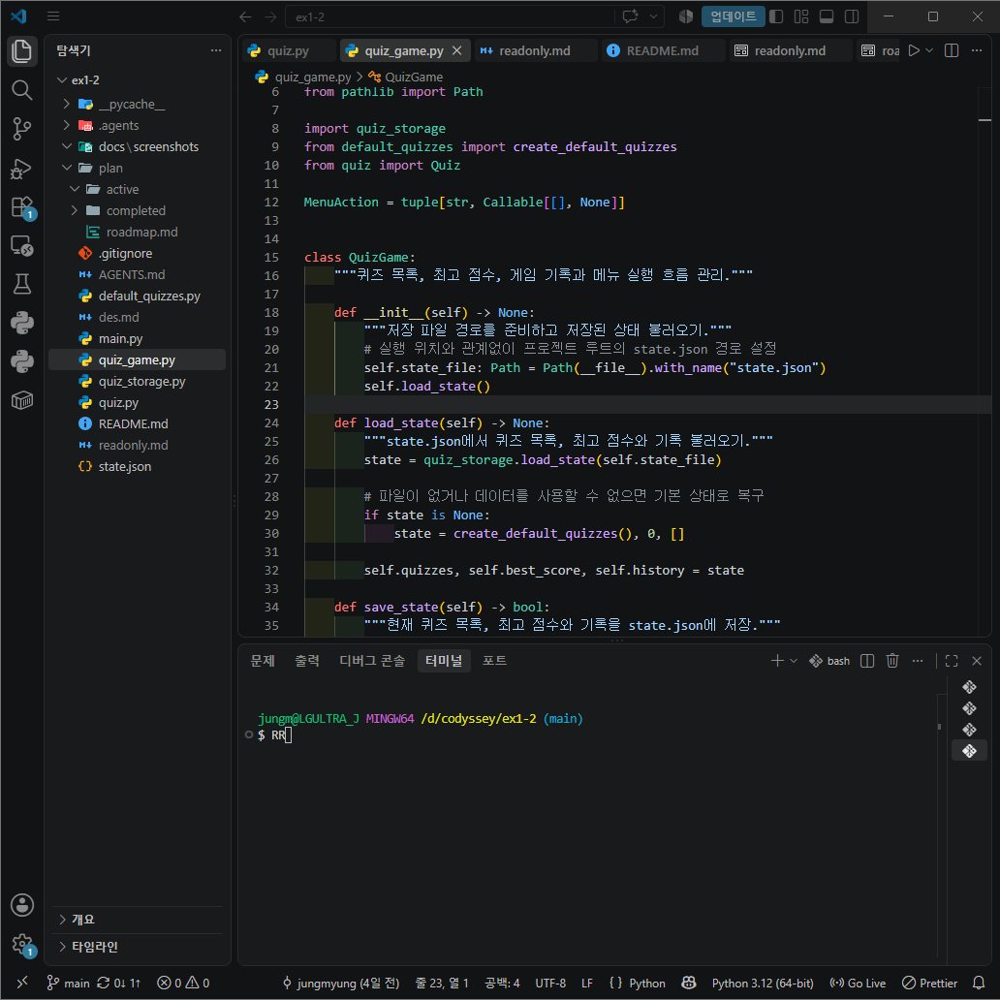

#### Python 버전

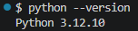

### Git 커밋 기록

`git log --oneline --graph` 실행 결과입니다.

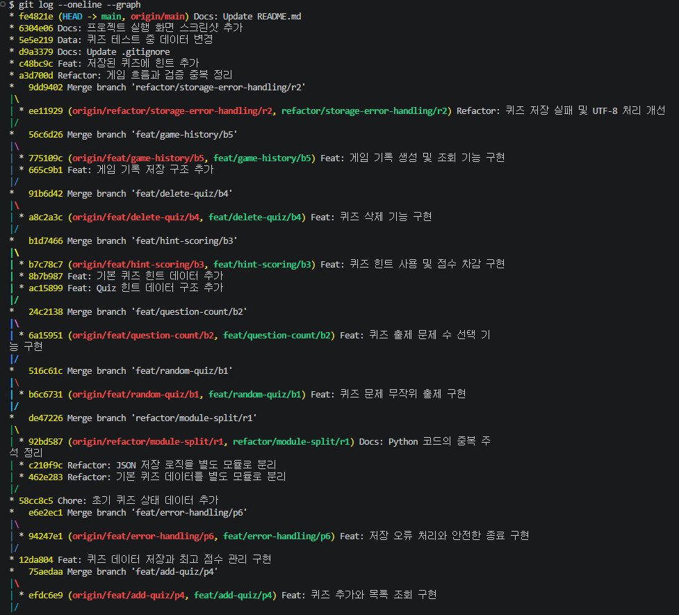

### 메인 메뉴

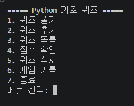

### 퀴즈 풀기

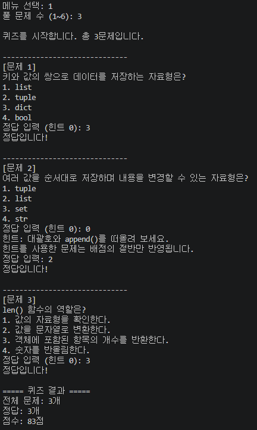

### 퀴즈 추가

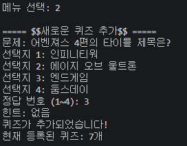

### 퀴즈 목록

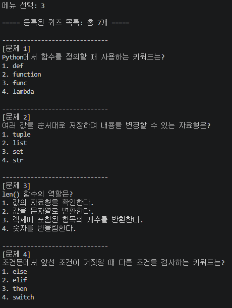

### 최고 점수 확인

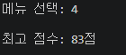

### 퀴즈 삭제

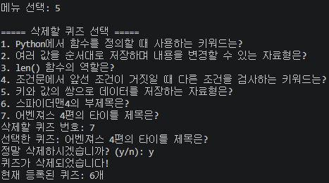

### 게임 기록

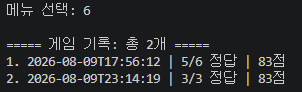

### 메뉴를 통한 종료

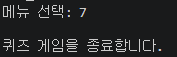

### `KeyboardInterrupt` 안전 종료

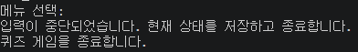

## 프로젝트 특징

- `Quiz`와 `QuizGame` 클래스로 문제 하나와 게임 전체의 책임을 분리했습니다.
- 기본 퀴즈 데이터와 JSON 저장 로직을 별도 모듈로 나눴습니다.
- 공통 입력 메서드로 반복되는 검증을 줄였습니다.
- 원본 퀴즈 순서를 변경하지 않고 무작위 문제를 선택합니다.
- 구체적인 예외 처리로 파일과 입력 오류에서도 안전하게 동작합니다.
- 저장 실패 시 변경 사항을 복원하여 현재 상태와 저장 파일을 일치시킵니다.
